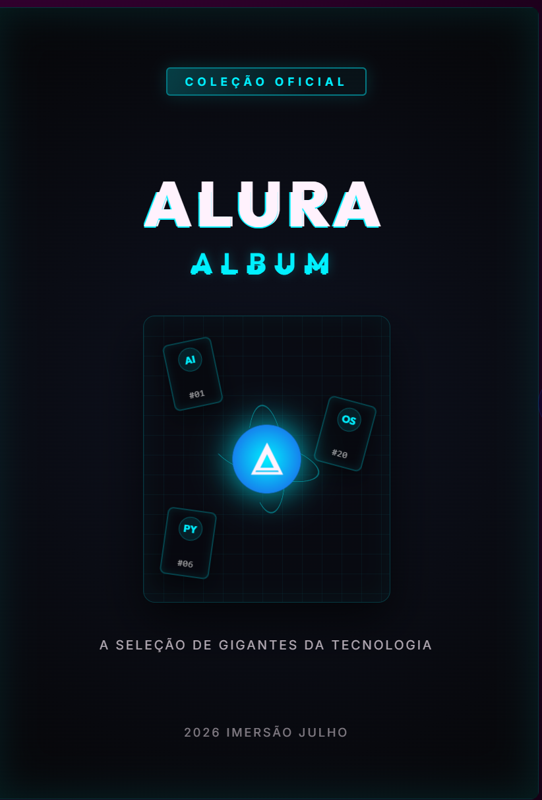
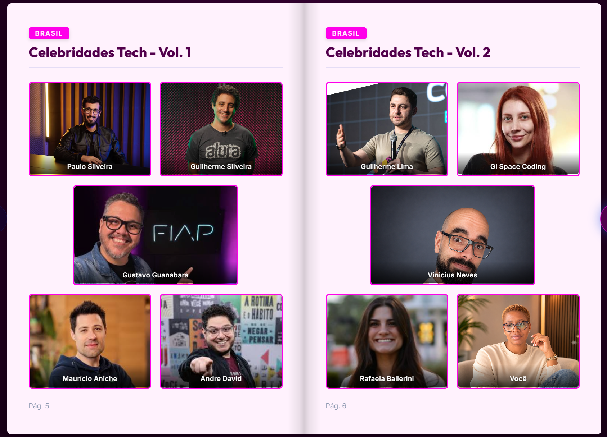

# Alura Album — Copa do Mundo Tech

## 🎬 Demonstração em vídeo

<p align="center">
  <a href="./assets/demo/album-demo.mp4">
    
  </a>
</p>

<p align="center">
  <strong>▶ Clique na imagem para ver o projeto em funcionamento.</strong>
</p>

<h1 align="center">📖 Alura Album Tech</h1>

<p align="center">
  Álbum digital interativo de personalidades da tecnologia,
  desenvolvido com HTML, CSS, JavaScript, FastAPI e Python.
</p>

<p align="center">
  
</p>

Álbum digital interativo dedicado a personalidades que marcaram a história da tecnologia. O projeto apresenta os nomes em páginas temáticas, simula a experiência de folhear um álbum físico e pode carregar as imagens das figurinhas através de uma API backend.

## Objetivo do projeto

O objetivo é criar uma experiência visual e educativa que reúna pioneiros e profissionais ligados à Inteligência Artificial, Python, bancos de dados, sistemas operacionais e educação tecnológica no Brasil.

O frontend foi construído com HTML, CSS e JavaScript puro. A animação de virar páginas utiliza a biblioteca **StPageFlip**, enquanto as imagens das figurinhas são obtidas de um backend configurado em `http://localhost:8000`.

## Funcionalidades

- Álbum digital com capa, seis páginas de figurinhas e contracapa.
- Efeito animado de viragem de página.
- Navegação pelos botões laterais.
- Navegação com as teclas de seta esquerda e direita.
- Viragem de página por arraste com rato ou toque.
- Som sintetizado de papel ao virar as páginas.
- Botão para ativar ou desativar o som.
- Carregamento automático das figurinhas através da rota `GET /figurinhas`.
- Associação entre o `id` devolvido pela API e o número de cada espaço do álbum.
- Adaptação visual para computador, tablet e telemóvel.
- Animação de entrada quando uma figurinha é carregada com sucesso.

## Estrutura dos ficheiros

### `index.html`

Define a estrutura e o conteúdo do álbum:

- carrega as fontes Google Fonts;
- liga o ficheiro `style.css`;
- cria o botão de som e os botões de navegação;
- contém a capa, as páginas temáticas, os espaços das 30 figurinhas e a contracapa;
- carrega a biblioteca StPageFlip através de CDN;
- carrega o ficheiro `app.js` no final da página.

Cada espaço de figurinha utiliza a classe `.sticker-slot` e contém um número, um nome e uma descrição. O número do espaço é usado pelo JavaScript para encontrar a figurinha correspondente na resposta da API.

### `style.css`

Responsável por toda a apresentação visual do projeto:

- paleta de cores e variáveis CSS;
- fundo geral da aplicação;
- dimensões do álbum e das páginas;
- grelha das figurinhas;
- capa e contracapa;
- botões de som e navegação;
- sombras, gradientes e animações;
- efeito visual de colagem das figurinhas;
- estilos responsivos para ecrãs menores.

A paleta principal está definida no bloco `:root`, no início do ficheiro.

### `app.js`

Controla o comportamento e a interatividade:

- define o endereço base da API em `API_BASE_URL`;
- consulta a rota `GET /figurinhas`;
- converte a resposta JSON numa estrutura de consulta por `id`;
- cria e insere as imagens nos espaços correspondentes;
- inicializa a biblioteca StPageFlip;
- implementa o arraste personalizado das páginas;
- controla os botões anterior e seguinte;
- permite navegação pelo teclado;
- gera o som de papel com a Web Audio API;
- controla o estado de som ligado ou desligado;
- mostra mensagens no console quando a API ou uma imagem não está disponível.

## Paleta de cores

As cores principais estão centralizadas no início do `style.css`:

```css
:root {
  --color-blue-universe: #3B002F;
  --color-deep-blue: #65004F;
  --color-tech-blue: #A00078;
  --color-dev-blue: #D61A9D;
  --color-new-black: #14000F;
  --color-white-snow: #FFF3FB;
}
```

Os nomes antigos das variáveis foram mantidos para evitar alterações em todos os seletores que já as utilizam. Os valores, porém, correspondem agora a uma paleta baseada em magenta.

> Nota: a capa ainda contém algumas cores declaradas diretamente, como `#00f0ff` e valores `rgba(0, 240, 255, ...)`. Essas cores não dependem do bloco `:root` e continuarão com aparência ciano até serem substituídas ou transformadas em novas variáveis CSS.

## Dependências externas

- [Google Fonts](https://fonts.google.com/): famílias `Inter` e `Outfit`.
- [StPageFlip](https://github.com/Nodlik/StPageFlip): animação de viragem das páginas.
- Backend compatível com a rota `GET /figurinhas`.

## Formato esperado da API

A rota `GET /figurinhas` deve devolver uma lista semelhante a:

```json
[
  {
    "id": 1,
    "nome": "Alan Turing",
    "imagem_url": "/imgs/01-alan-turing.jpg"
  }
]
```

O campo `id` deve corresponder ao número mostrado no espaço da figurinha. O campo `imagem_url` deve conter o caminho público da imagem no servidor backend.

## Como executar

### 1. Iniciar o backend

No diretório do backend, execute o servidor FastAPI. Por exemplo:

```bash
uvicorn main:app --reload
```

Por configuração atual, o backend deve estar disponível em:

```text
http://localhost:8000
```

### 2. Iniciar o frontend

Sirva os ficheiros com um servidor local. No VS Code, pode utilizar a extensão **Live Server**. Outra opção é executar:

```bash
python -m http.server 5500
```

Depois, abra no navegador:

```text
http://localhost:5500
```

## Personalização

- Para alterar o conteúdo das páginas, edite `index.html`.
- Para alterar cores, tamanhos, animações ou responsividade, edite `style.css`.
- Para alterar a API, a navegação, o som ou o carregamento das figurinhas, edite `app.js`.
- Para utilizar outro endereço de backend, altere `API_BASE_URL` no início de `app.js`.
